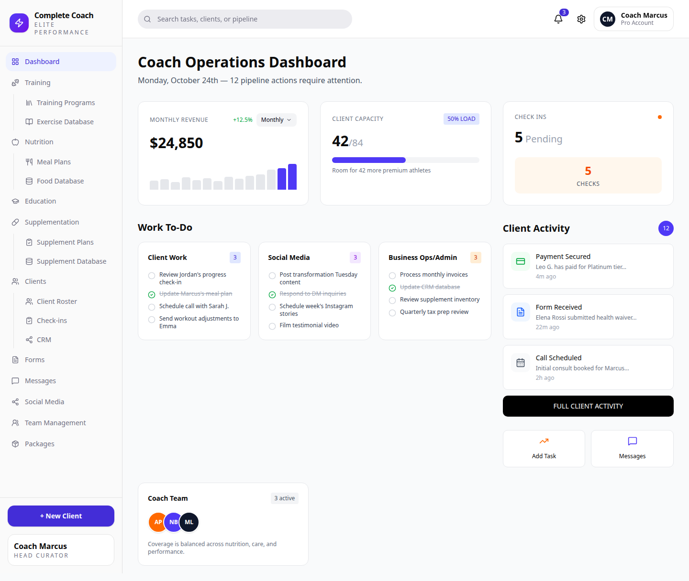
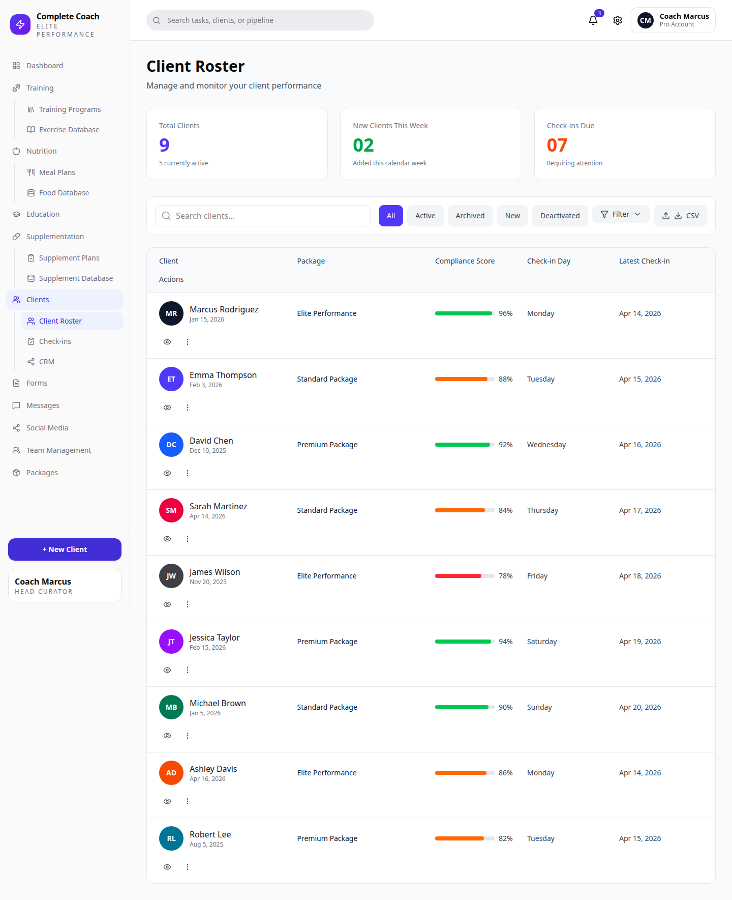
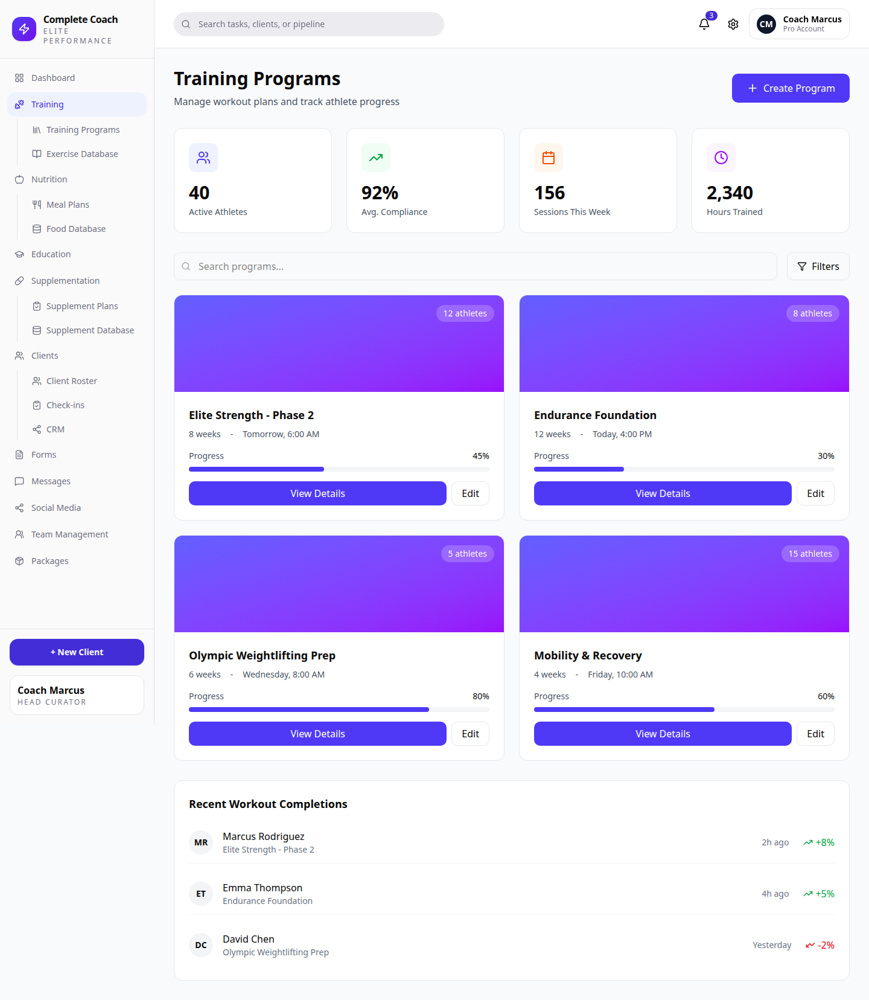
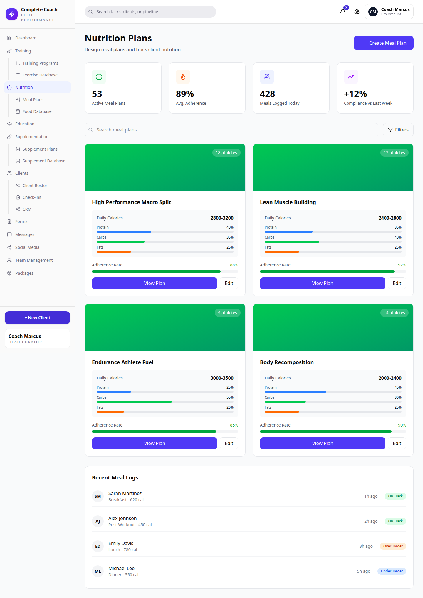
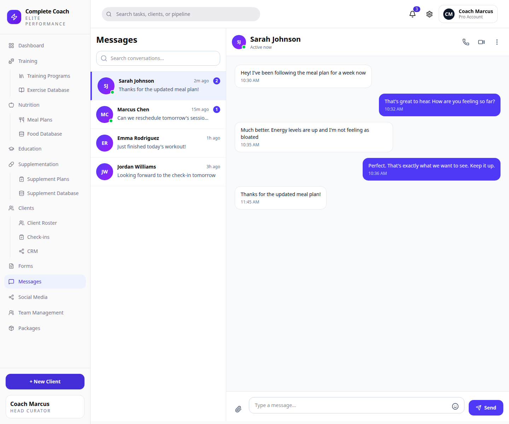

# Complete Coach

Complete Coach is a multi-tenant coaching operations platform for fitness and performance coaching businesses. It is designed to bring client management, CRM, check-ins, training, nutrition, education, supplementation, messaging, packages, team operations, and analytics into one coach-facing workspace.

The current baseline is the **M1 fixture-backed UI preview**: a launchable Next.js application that ports the supplied UI design across all major product areas using typed sample data. Backend persistence, authentication, Neon/PostgreSQL, Stripe, R2, Resend, and production integrations begin in later phases.

## Live Preview

Production preview:

https://complete-coach-ten.vercel.app

Repository:

https://github.com/MikeS071/complete-coach

## Screenshots

### Operations Dashboard



### Client Roster



### Training Programs



### Nutrition Plans



### Messaging



## Current Capabilities

- App shell with sidebar navigation, global search, notifications, and user menu.
- Dashboard with operations metrics, priority tasks, work queues, quick actions, and pipeline activity.
- Clients, CRM, client profiles, check-ins, and form builder UI.
- Training overview, program library, exercise database, and add-exercise workflow.
- Nutrition overview, meal plan library, and food database.
- Education resource library and add-resource workflow.
- Supplement protocols, supplement plans, and supplement database with a local slide-in creation flow.
- Messages UI with conversation switching, search, and local message sending.
- Packages, team management, and social media planning pages.
- Typed fixtures for all sample data.
- Playwright route/accessibility smoke coverage for the UI stub.

## Current Scope Boundary

This release is intentionally a UI baseline. It does **not** yet include:

- Authentication or tenant sessions.
- Neon/PostgreSQL persistence.
- Prisma migrations.
- Stripe Billing or Stripe Connect.
- R2 uploads.
- Resend email.
- Production messaging transport.
- External analysis APIs or webhooks.

Those foundations start in Ticket 011 and later roadmap phases.

## Tech Stack

- **Application:** Next.js App Router, React, TypeScript
- **UI:** Tailwind CSS, shadcn-compatible primitives, Radix where needed
- **Testing:** Vitest, Testing Library, Playwright
- **Planned database:** PostgreSQL on Neon
- **Planned ORM:** Prisma
- **Planned auth:** NextAuth/Auth.js
- **Planned deployment:** Vercel
- **Planned integrations:** Stripe Connect, Cloudflare R2, Resend, Inngest

## Repository Structure

```text
apps/web/                 Next.js UI application
docs/                     Product, architecture, roadmap, API, and deployment docs
docs/assets/screenshots/  README and documentation screenshots
scripts/                  Verification and repository guard scripts
ui-design/                Imported UI design archive
.agents/                  Agent profiles and skills for implementation workflow
.codex/                   Repository coding rules
```

## Local Development

Requirements:

- Node.js 22+
- pnpm 10+

Install dependencies:

```bash
pnpm install --frozen-lockfile
```

Run the web app:

```bash
pnpm --dir apps/web dev
```

Open:

```text
http://localhost:3000
```

## Verification

Run the full repository gate:

```bash
pnpm check
```

Run app-level checks:

```bash
pnpm --dir apps/web lint
pnpm --dir apps/web typecheck
pnpm --dir apps/web test
pnpm --dir apps/web coverage
pnpm --dir apps/web build
```

Run Playwright E2E:

```bash
pnpm --dir apps/web exec playwright install chromium
pnpm --dir apps/web e2e
```

Current verified baseline:

- 57 Vitest tests
- 46 Playwright tests
- 90%+ coverage
- Production build passes
- File-size guard enforces the 800-line cap for product/docs/CI files

## Deployment

The app is deployed on Vercel with `apps/web` as the project root.

Vercel settings:

- Install command: `cd ../.. && pnpm install --frozen-lockfile`
- Build command: `pnpm build`
- Output directory: `.next`
- Framework: Next.js

No environment variables are required for the current M1 UI preview. Neon credentials should not be configured until the Prisma/Auth foundation is implemented.

Detailed deployment notes:

[docs/deployment/vercel-neon-preview.md](docs/deployment/vercel-neon-preview.md)

## Documentation

Core project docs:

- [Product specification](docs/product/product-spec.md)
- [Architecture specification](docs/architecture/architecture-spec.md)
- [Data model specification](docs/architecture/data-model-spec.md)
- [API contract specification](docs/api/api-contract-spec.md)
- [Implementation roadmap](docs/roadmap/implementation-roadmap.md)
- [Implementation ticket map](docs/roadmap/implementation-ticket-map.md)
- [UI design analysis](docs/design-system/ui-design-analysis.md)
- [Visual parity gate](docs/design-system/visual-parity-gate.md)
- [Production readiness checklist](docs/checklists/production-readiness-checklist.md)

## Roadmap

M1 is complete: the UI stub is launchable, deployed, covered by tests, and visually tracked against the supplied design.

Next phase:

**Ticket 011: Auth and tenant foundation**

- Add NextAuth/Auth.js.
- Add Prisma and Neon environment validation.
- Implement organizations, users, memberships, and role/capability helpers.
- Add initial migrations and tests.

## Security Notes

- Do not commit secrets or populated `.env` files.
- Use `.env.example` only as a placeholder reference.
- Neon, Stripe, R2, Resend, and Auth secrets must be stored in Vercel/local secret stores when those phases are implemented.

## License

See [LICENSE](LICENSE).
